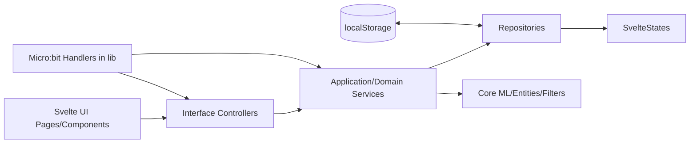
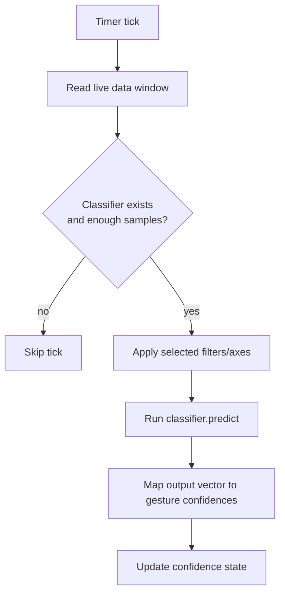

# ML-Machine Architecture

## Purpose

ML-Machine is a browser-based, interactive machine-learning application for gesture recognition with micro:bit devices.
Users collect accelerometer samples, label recordings as gestures, train a model (Neural Network or KNN), and run live predictions that can trigger visual/audio/IO outputs.

This document describes the current architecture as implemented in the repository.

## Technology Stack

- Frontend: Svelte + TypeScript + Vite
- Styling: Windi CSS
- ML runtime: TensorFlow.js plus custom model abstractions
- Device communication: `microbyte` and browser hardware APIs (Web Bluetooth/USB)
- Persistence: browser localStorage wrappers
- Testing: Vitest + Testing Library

## High-Level Architecture

The project is organized around a layered backend inside the frontend app:

- `src/frontend`, `src/pages`, `src/components`, `src/router`: UI and navigation
- `src/backend/interface-controller`: controllers consumed by Svelte views
- `src/backend/application`: application services/engines
- `src/backend/domain`: service contracts and implementations
- `src/backend/infrastructure`: repository adapters (state and localStorage)
- `src/backend/statemanagement`: state abstractions and Svelte-backed state model
- `src/core`: domain entities, filters, vectors, model/classifier abstractions and trainers
- `src/lib`: browser/device integration utilities, stores, adapters

Dependency direction is mostly inward: UI -> controllers -> services -> repositories/core.

## Composition Root and Bootstrapping

The composition root is `MLMachine` in `src/backend/interface-adapter/MLMachine.ts`.
It wires repositories, services, listeners, states, controllers, and starts the live prediction engine.

Startup flow:

1. `src/main.ts` mounts `src/App.svelte`.
2. `src/App.svelte` gets controllers from `MLMachine.getInstance()`.
3. `MLMachine` constructor builds the object graph and starts `PollingPredictorEngine`.
4. `src/frontend/view/AppRoot.svelte` loads shell UI and route content.

This is effectively a singleton service locator plus manual dependency injection.

## Runtime Views and Routing

- Router: `src/router/Router.svelte` + `src/router/Router.ts`
- Route components are dynamically imported (page-level code splitting).
- Pages typically pull controller instances via `getControllers()`.

Example pattern:

- `src/pages/DataPage.svelte` reads gesture state and invokes controller actions.
- `src/pages/training/TrainingPage.svelte` gates training UI on data sufficiency via `DataController`.

## Core Runtime Flows

### 1) Data Collection and Recording

1. Micro:bit handler receives accelerometer events (`InputMicrobitHandler`).
2. Events are converted to vector data and pushed to `DataController.addLiveData(...)`.
3. `DataServiceImpl` writes samples through `LiveDataRepository` (`StatesLiveDataRepository`) into the state-backed live buffer.
4. Recording (`RecordingServiceImpl`) waits for configured duration, snapshots buffered data, and stores a `Recording` on a gesture.

### 2) Training

1. UI invokes classifier/controller training actions.
2. `ModelServiceImpl` builds dataset from gestures and selected axes/filters through `DataServiceImpl`.
3. Selected trainer runs:
   - KNN: `KNNModelTrainer`
   - Neural Network: `NeuralNetworkModelTrainer`
4. `ClassifierController` wraps trained model in `VectorClassifier` and stores it via `ClassifierService`.

### 3) Live Prediction Loop

`PollingPredictorEngine` runs on an interval:

1. Pulls recent live data window (`duration`, `sampleSize`).
2. Skips prediction if no classifier or insufficient samples (< 8 for filter requirements).
3. Applies selected filters/axes to build `VectorPredictionInput`.
4. Runs classifier prediction.
5. Maps output vector to gesture IDs and saves confidence values to state.

Confidence updates then drive UI and output behavior.

### 4) Micro:bit Connection and Output

- Input/output roles are handled by dedicated handlers in `src/lib/microbit-interfacing`.
- `CombinedMicrobitHandler` supports single-device input+output mode.
- Connection states are represented in backend domain objects and persisted via state repositories.
- Output mode can switch between proprietary firmware and MakeCode behavior based on device messages.

## State and Data Model

State is centralized in `SvelteStates` (`src/backend/statemanagement/SvelteStates.ts`) using abstract state wrappers.
It contains slices for:

- gestures and selected gesture
- live data buffer and prediction
- selected axes and filters
- model settings/training status
- KNN debug points and NN training iterations
- confidences and recording status
- micro:bit connection and output target
- notifications and UI-adjacent operational state

Most infrastructure repositories are thin adapters over this state object (`States*Repository`).

## Persistence Boundaries

- Gesture dataset persistence: `LocalStorageGestureRepository`
- User reconnect session flag: `LocalStorageUserSessionRepository`
- Other runtime state: in-memory Svelte stores (not long-term persisted)

The `ControlledStorage` utility wraps localStorage interactions.

## Feature Flags and Build Variants

Feature values are loaded from `features.json` through a feature provider.

Build variants are prepared by `prepEnv.js`, which copies variant-specific:

- `features.json`
- `windi.config.js`

from `src/__viteBuildVariants__/{variant}` into repository root before running Vite.

Supported targets:

- `branded`
- `unbranded`
- `simple`
- `experimental`

## Firmware Boundary

Firmware source is under `microbit/`:

- `microbit/v1`: micro:bit v1 source
- `microbit/v2`: micro:bit v2 source and build scripts

The web app depends on compatible device firmware and version signaling for some behaviors.

## Testing Layout

Tests live under `src/__tests__/` with grouped suites such as:

- `backend/`
- `ml/`
- `csv/`
- `site/`
- `archtest/`

Tooling is configured through Vitest in `vite.config.ts` and setup in `src/__tests__/setup_tests.ts`.

## Architectural Diagram

## Prediction Loop Diagram

## Notable Design Characteristics

- Strong separation between core ML/domain objects and UI framework code.
- Controllers provide a stable interface for Svelte pages.
- State is centralized and highly observable via Svelte store adapters.
- MLMachine.ts is a large bootstrapping class. Everything in the application is initialized there. It's the bunch of wires that ties everything together