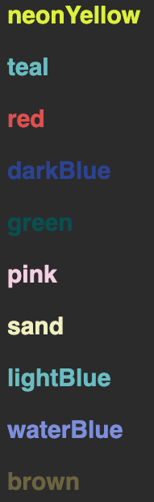

# About ultra:bit assets

All resources can be accessed through UltrabitTheme.ts and is directly sourced
from https://www.dr.dk/om-dr/designmanager/dr-brands/ultrabit

## Overview / content

- Colors
- Smileys
- Background images
- Ultrabit font
- Ultrabit logo
- Partner logos

### colors

example

```sveltehtml 
<script>
	import UltrabitTheme from "./UltrabitTheme";
</script>
<div style="backgroundColor: {UltrabitTheme.colors.neonYellow['100']}"></div>
```

each color can be accessed through colors.[color].[opacity]. The colors can be seen below. Note: atm there are only 100%
opaque variants, but i suspect this to change, and you are free to add as many as you would like.



<span style="font-size:30px;color:rgba(222, 242, 24, 1)">**neonYellow**</span>

<span style="font-size:30px;color:rgba(100, 190, 195, 1)">**teal**</span>

<span style="font-size:30px;color:rgba(225, 75, 75, 1)">**red**</span>

<span style="font-size:30px;color:rgba(40, 65, 150, 1)">**darkBlue**</span>

<span style="font-size:30px;color:rgba(0, 80, 80, 1)">**green**</span>

<span style="font-size:30px;color:rgba(245, 205, 225, 1)">**pink**</span>

<span style="font-size:30px;color:rgba(240, 240, 190, 1)">**sand**</span>

<span style="font-size:30px;color:rgba(100, 190, 195, 1)">**lightBlue**</span>

<span style="font-size:30px;color:rgba(122, 140, 223, 1)">**waterBlue**</span>

<span style="font-size:30px;color:rgba(109, 100, 62, 1)">**brown**</span>

### smileys

There are 2 smileys for each color. One where the eyes and mouthes are opaque and one where it is transparent.
<div style="background-color: rgba(245, 205, 225, 1)">


</div>

variants can be seen below

```
NEON_YELLOW = "neonYellow",
TEAL = "teal",
RED = "red",
DARK_BLUE = "darkBlue",
GREEN = "green",
PINK = "pink",
SAND = "sand",
LIGHT_BLUE = "lightBlue",
```

The source location can be found as

```jsx
 // example
```

However you can also use the UltrabitSmiley component

```sveltehtml 
<script>
	import UltrabitSmiley from "./UltrabitSmiley.svelte";
	import { UltrabitSmileyVariant } from "./UltrabitTheme";
</script>

<UltrabitSmiley variant={UltrabitSmileyVariant.DARK_BLUE} />
<UltrabitSmiley variant={UltrabitSmileyVariant.TEAL} transparent />
<UltrabitSmiley variant="red" size="22" transparent />
```

### Background images

One thing to note, is these are heavily compressed, as the original file sizes were enormous. Use at own risk.

examples:

```sveltehtml 
<script>
	import UltrabitTheme from "./UltrabitTheme";
</script>


<div style="background-image: url('{UltrabitTheme.backgroundImages.cardboard}')"></div>
```

```json
grayLg: "ultrabit/background_images/gray_lg.jpg",
grayMd: "ultrabit/background_images/gray_md.jpg",
black: "ultrabit/background_images/black.jpg",
cardboard: "ultrabit/background_images/cardboard.jpg",
cardboardRollup: "ultrabit/background_images/cardboard_rollup.jpg"
```

### Ultrabit font


The ultrabit font is placed at the global css level. Access using `font-ultrabit`

```sveltehtml 
<script>
	import UltrabitTheme from "./UltrabitTheme";
</script>

<p class="{UltrabitTheme.ultrabitFont}">EXAMPLE</p>
```

or simply

```sveltehtml
<p class="font-ultrabit">EXAMPLE</p>
```

### Ultrabit logo


```sveltehtml 
<script>
	import UltrabitTheme from "./UltrabitTheme";
</script>


```

### Partner logos


```sveltehtml 
<script>
	import UltrabitTheme from "./UltrabitTheme";
</script>


```
